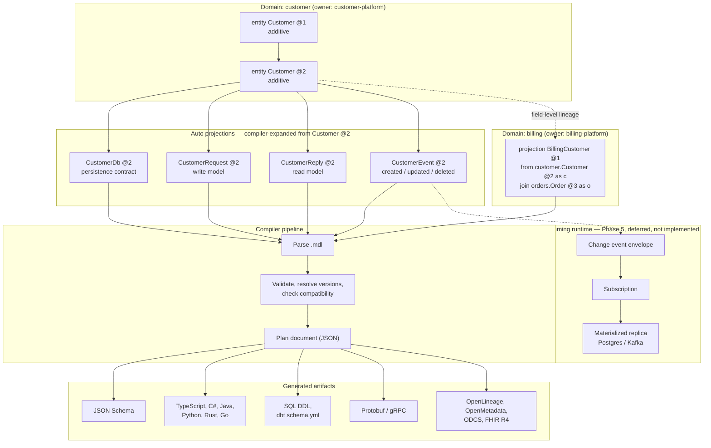

# Modelable

Modelable is a compiler and language server for versioned, domain-owned data
models. Define canonical models and projections in `.mdl` files, then validate
their compatibility, inspect field-level lineage, detect governance gaps, and
generate artifacts for the systems that consume them.

## Why Modelable?

Data contracts often become fragmented across application types, database
schemas, API definitions, and catalog metadata. Modelable keeps the semantic
contract in one versioned source and derives target-specific representations
without losing ownership, classification, lineage, or compatibility context.

```text
.mdl sources -> validate and resolve -> plan and govern -> generate artifacts
```

## How it fits together

A canonical entity, its compiler-expanded `db`/`request`/`reply`/`event`
projections, a hand-authored cross-domain projection, and the artifacts and
(deferred) streaming path they can drive:



Everything above the "Streaming runtime" box is implemented by the local
compiler today. `subscription`, adapter-driven materialization, and the
runtime engine parse and validate but do not execute yet — see
[Architecture and system specification](docs/architecture.md) for the exact
implemented/deferred boundary of every concept in the diagram.

## Install

Modelable requires Python 3.14.

```bash
uv tool install modelable
modelable --version
```

For an isolated one-off command:

```bash
uvx modelable --help
```

## Define a model

```text
domain customer {
  owner: "customer-platform"

  entity Customer @ 1 (additive) {
    @key customerId: uuid
    @pii email?: string
    displayName: string
  }
}
```

Save the definition as `customer.mdl`, then validate and compile it:

```bash
modelable validate customer.mdl --strict
modelable compile customer.mdl --target json-schema --out generated/schema
modelable compile customer.mdl --target typescript --out generated/types
```

## Capabilities

- Parse and validate versioned models, projections, annotations, and workspace definitions.
- Resolve exact versions and compatible version ranges.
- Detect additive and breaking contract changes and affected projections.
- Trace projection fields to canonical source fields.
- Report structurally missing access and classification metadata.
- Expand automatic database, request, reply, and event projections.
- Author a model version as a delta against its prior version
  (`evolves @ N { add/remove/rename/replace ... }`) instead of repeating
  its complete field list, with tooling to convert either direction
  (`modelable compact-version` / `expand-version`) and to extract a
  repeated inline enum shape into a shared, versioned `semantic` enum
  (`modelable extract-enum`).
- Generate JSON Schema, OpenAPI 3.1, Markdown, TypeScript, C#, Java, Python,
  Rust, Go, SQL DDL, dbt `schema.yml`, FHIR R4 profile, OpenMetadata JSON, and
  OpenLineage event, ODCS, Protobuf, Avro record, event-sink contract, and
  Scalable-oriented gRPC artifacts.
- Provide diagnostics, completion, hover, navigation, references, rename, formatting, and other editor features through the language server.
- Import or assist with models through optional LLM provider integrations.

The local compiler and language-server toolchain are the supported 1.0 stable
surface. Apicurio JSON Schema artifact publish/pull and Marquez-compatible
OpenLineage event sync are available for derived artifacts. Live catalog
publishing, distributed synchronization, OpenLineage runtime event collection,
and runtime materialization remain future candidates.

## Browser playground

The static [Modelable playground](https://ktjn.github.io/modelable/playground/)
runs the compiler locally in the browser. It supports creating, importing,
renaming, deleting, selecting, and editing multiple `.mdl` files, then
validating or generating artifacts from the complete workspace.

The one local workspace is restored automatically from IndexedDB. Source text
never leaves the page; compiler output is not persisted. If browser storage is
unavailable, editing continues in memory with an explicit status. Invalid or
incompatible stored data is left untouched until the user exports it or resets
the workspace.

Beyond the editor, the playground provides:

- Protocol v2 language services: 300 ms live diagnostics plus browser-native
  completion, hover, go-to-definition, references, and rename over the complete
  local workspace, usable from the last parseable semantic snapshot while
  current text contains a syntax error.
- Domain and entity graph visualization with field lineage tracing, version
  compatibility views with downstream projection impacts, governance findings,
  and SVG/PNG diagram export.
- Local AI assistance via WebLLM (or an optional local Ollama server) for
  entity generation and explanations, always behind validated previews and
  explicit user acceptance.
- Offline operation through a service worker, accessibility enforcement,
  performance budgets, and automatic documentation retrieval (`/docs`-style
  questions routed to the bundled RAG index).

Diagnostics, completion results, hover content, and other derived state remain
in-memory only and are never persisted.

## 1.0 stable surface

Modelable 1.0 stabilizes the local compiler and language-server toolchain.

**In scope for 1.0:**

- `.mdl` language: syntax, types, projections, ownership, classification, and
  access metadata.
- CLI: `validate`, `compile`, `diff`, `generate`, `attach`, `spec`, and the
  language server.
- Generated artifacts: JSON Schema, TypeScript, C#, Java, Python, Rust, Go,
  SQL DDL, dbt `schema.yml`, Markdown, FHIR R4 profile, OpenMetadata JSON,
  OpenLineage event, ODCS, Protobuf, and Scalable-oriented gRPC formats.
- Compatibility, lineage, and governance report output.
- Apicurio JSON Schema registry artifact push/pull.
- Marquez-compatible OpenLineage event sync via `modelable sync --lineage`.
- VS Code extension shipped as a VSIX companion artifact with the 1.0 release.

**Deferred from 1.0:**

- VS Code Marketplace distribution (post-1.0).
- Live OpenMetadata catalog synchronization and runtime OpenLineage collection.
- Remote tracked-spec polling and authenticated source access.
- Runtime subscriptions, adapters, replay, and materialization.
- Distributed registry synchronization beyond the current file-first model.

## Development

```bash
cd cli
uv sync --extra dev --frozen
uv run pytest tests/ --tb=short
uv run modelable validate ../samples/mvp --strict
```

See [CONTRIBUTING.md](CONTRIBUTING.md) for the complete contributor workflow.

## Documentation

Hosted: **https://ktjn.github.io/modelable/**

- [Documentation index](docs/README.md)
- [Language reference](docs/language-reference.md)
- [Tooling reference](docs/cli-reference.md)
- [Architecture and system specification](docs/architecture.md)
- [Getting started and migration](docs/getting-started.md)
- [Sample models](samples/README.md)
- [Changelog](CHANGELOG.md)
- [Roadmap](ROADMAP.md)
- [Project governance](GOVERNANCE.md)

## License

Licensed under the [Apache License 2.0](LICENSE).
